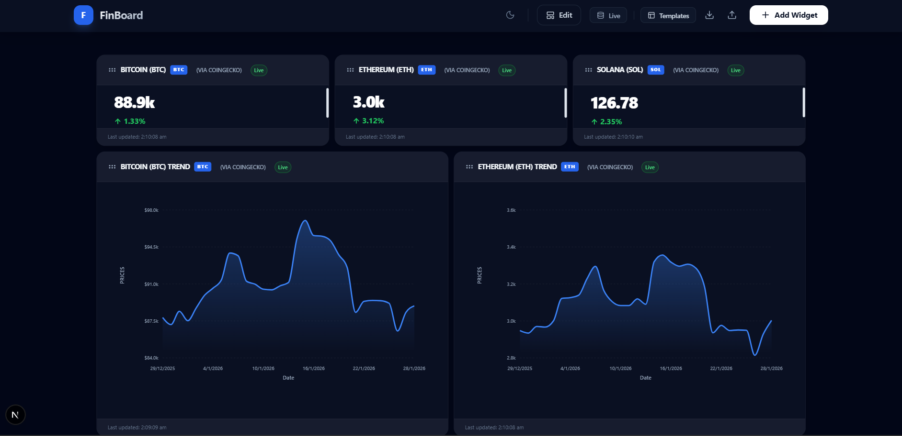
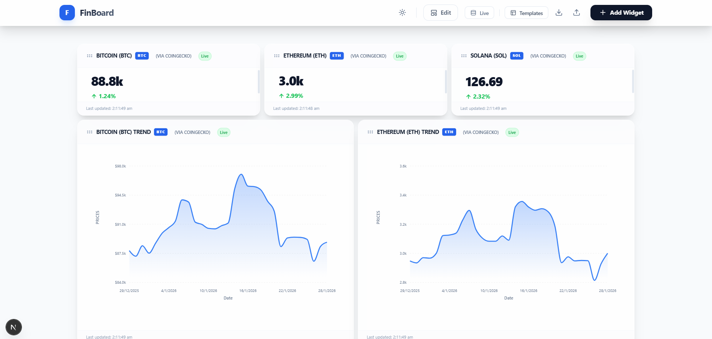

# FinBoard - Advanced Finance Dashboard

🚀 ***Live Demo:*** https://finboard-bay-theta.vercel.app/

A production-grade, highly customizable finance dashboard built with Next.js 14, React Grid Layout, and Tailwind CSS. Connect to any JSON API and visualize real-time financial data through draggable widgets.




## ✨ Key Features

- **🎯 Universal API Support**: Connect to ANY JSON endpoint - built-in support for CoinGecko, Alpha Vantage, Finnhub, and any custom API
- **🔧 Visual Data Mapper**: Interactive JSON explorer to map API fields to widget properties (no code required)
- **📊 3 Widget Types**: 
  - **Cards** - Display single metrics with delta indicators
  - **Charts** - Line/Area charts with time series data (powered by Recharts)
  - **Tables** - Paginated tables with search, sort, and 4-column auto-detection
- **🎨 Premium Design**: Glassmorphism UI with Dark/Light theme toggle
- **📐 Responsive Grid**: Drag-and-drop layout with automatic mobile stacking (React Grid Layout)
- **💾 Smart Persistence**: LocalStorage auto-save + Export/Import configurations
- **🔄 Real-time Polling**: Configurable refresh intervals with intelligent caching
- **📝 Widget Descriptions**: Add optional descriptions to document your widgets
- **🎭 Template System**: Pre-built dashboards (Crypto Tracker, Stock Market)
- **🛡️ Error Resilience**: Error boundaries, mock fallbacks, and rate-limit handling

---

## 🚀 Quick Start

### 1. Clone the Repository
```bash
git clone https://github.com/Venkat-737/FinBoard.git
cd FinBoard
```

### 2. Install Dependencies
```bash
npm install
```

### 3. Configure API Keys (Optional)

The app works perfectly **without API keys** using built-in mock data. For real-time data, create a `.env.local` file:

```bash
# CoinGecko (Cryptocurrency Data) - No API key required!
# Public API: https://www.coingecko.com/en/api

# Finnhub (Stock Market Data)
# Get free key at: https://finnhub.io/register
NEXT_PUBLIC_FINNHUB_KEY=your_finnhub_key_here

# Alpha Vantage (Stock Market Data)
# Get free key at: https://www.alphavantage.co/support/#api-key
NEXT_PUBLIC_ALPHA_VANTAGE_KEY=your_alpha_vantage_key_here
```

### 4. Run Development Server
```bash
npm run dev
```

Open [http://localhost:3000](http://localhost:3000) in your browser.

---

## 🌐 Integrated APIs

### Real APIs (Fully Working)

1. **CoinGecko** 🟢 (No API Key Required)
   - Cryptocurrency prices, market data, historical charts
   - Endpoints: `/simple/price`, `/coins/{id}/market_chart`
   - Free tier: Unlimited requests (with rate limits)

2. **JSONPlaceholder** 🟢 (No API Key Required)
   - Test API for tables and generic data structures
   - Endpoint: `/users`, `/posts`, `/todos`
   - Free public API

3. **Finnhub** 🔑 (API Key Required)
   - Real-time stock quotes, candles (OHLCV data)
   - Endpoints: `/quote`, `/stock/candle`
   - Free tier: 60 API calls/minute

4. **Alpha Vantage** 🔑 (API Key Required)
   - Global stock quotes, daily time series
   - Endpoints: `GLOBAL_QUOTE`, `TIME_SERIES_DAILY`
   - Free tier: 25 requests/day

### Custom APIs
- The app supports **any JSON API** - just paste the URL and map the fields!

---

## 🧪 Testing Guide

### Test 1: Load a Template Dashboard

**Option A: Crypto Tracker** (CoinGecko - No API key needed)
1. Click **Crypto Tracker** button in the header
2. Click **Confirm** on the popup
3. See 3 live crypto cards (BTC, ETH, SOL) + 2 trend charts

**Option B: Stock Market** (Alpha Vantage - Mock data will be used if no key)
1. Click **Stock Market** button
2. See IBM stock chart + quote card + company overview table

---

### Test 2: Create a Custom Widget

#### Step 1: Choose Widget Type
1. Click **Add Widget** (green ➕ button, top right)
2. Enter title: `Bitcoin Price`
3. Enter description (optional): `Live BTC/USD with 24h change`
4. Select **Metric Card**
5. Click **Next**

#### Step 2: Connect to API
1. Click the **💰 Bitcoin** preset button (auto-fills the CoinGecko URL)
2. Click **Fetch Data**
3. The app fetches real data from CoinGecko
4. Click **Next**

#### Step 3: Map Data Fields
1. In the **JSON Explorer** (left panel), expand the tree
2. Click on `bitcoin` → `usd` (this is the price)
3. It appears in the **Primary Value** field on the right
4. Click on `bitcoin` → `usd_24h_change` (this is the delta)
5. It appears in the **Delta Value** field
6. Click **Create Widget**

**Expected Result**: A card showing live Bitcoin price with green/red percentage change!

---

### Test 3: Create a Chart

1. Click **Add Widget**
2. Title: `Ethereum 30-Day Trend`
3. Select **Line Chart**
4. Click **Next**
5. Click **📈 Ethereum History** preset
6. Click **Fetch Data** → Click **Next**
7. Click the root `prices` array in JSON Explorer
8. The app auto-detects X (timestamp) and Y (price) fields
9. Click **Create Widget**

**Expected Result**: A beautiful area chart showing 30 days of ETH price history!

---

### Test 4: Create a Table

1. Click **Add Widget**
2. Title: `Users Directory`
3. Select **Data Table**
4. Click **Next**
5. Enter URL: `https://jsonplaceholder.typicode.com/users`
6. Click **Fetch Data** → Click **Next**
7. Click the root `ROOT` (the entire array) in JSON Explorer
8. Click **Create Widget**

**Expected Result**: A sortable, searchable table with user data!

**Try the features:**
- 🔍 Search: Type "Leanne" in the search box
- 🔽 Sort: Click any column header (name, email, etc.)
- 📄 Paginate: Click arrows to navigate pages

---

### Test 5: Drag & Drop Layout

1. **Move widgets**: Click and drag any widget header
2. **Resize widgets**: Drag the bottom-right corner
3. **Delete widgets**: Click the ❌ in the widget header
4. **Edit widgets**: Click the ✏️ icon to modify settings
5. **Refresh the page** (F5)

**Expected Result**: Layout is auto-saved and restored!

---

### Test 6: Export & Import

1. Click the **Download icon** (⬇️) in the header
2. File `finboard-backup-YYYY-MM-DD.json` downloads
3. Click **Edit Layout** → Delete all widgets
4. Click the **Upload icon** (⬆️)
5. Select your backup file
6. Confirm the popup

**Expected Result**: All widgets restored instantly!

---

### Test 7: Theme & Polish

1. **Theme**: Click the 🌙/☀️ icon to toggle Dark/Light mode
2. **Responsive**: Resize your browser - widgets auto-stack on mobile
3. **Edit Mode**: Click **Edit Layout** to toggle drag-and-drop on/off

---

## 🏗️ Project Structure

```
finboard/
├── app/                         # Next.js 14 App Router
│   ├── page.tsx                 # Main dashboard page
│   ├── layout.tsx               # Root layout with metadata
│   └── globals.css              # Global styles & CSS variables
├── components/
│   ├── builder/                 # Widget Creation Wizard
│   │   ├── AddWidgetModal.tsx   # 3-step wizard (Type → API → Map)
│   │   ├── EditWidgetModal.tsx  # Edit existing widget
│   │   ├── JsonExplorer.tsx     # Collapsible JSON tree viewer
│   │   └── JsonPathPicker.tsx   # Path selector for Edit mode
│   ├── dashboard/               # Layout & Templates
│   │   ├── DashboardGrid.tsx    # React Grid Layout wrapper
│   │   ├── DashboardControls.tsx # Export/Import/Templates
│   │   ├── Header.tsx           # Top navigation bar
│   │   ├── WidgetWrapper.tsx    # Widget frame with header/footer
│   │   └── templates.ts         # Pre-built dashboard configs
│   ├── widgets/                 # Widget Renderers
│   │   ├── CardWidget.tsx       # Metric card with delta
│   │   ├── ChartWidget.tsx      # Recharts line/area charts
│   │   ├── TableWidget.tsx      # Paginated data table
│   │   └── WidgetRenderer.tsx   # Router component
│   └── ui/                      # Reusable UI
│       └── ErrorBoundary.tsx    # Widget crash protection
├── lib/                         # Core Logic
│   ├── api-adapters.ts          # Transform API responses
│   ├── data-utils.ts            # Nested path resolver
│   ├── mock-service.ts          # Mock data generator
│   ├── usePolling.ts            # Real-time fetch hook
│   └── useWidth.ts              # Responsive grid hook
├── store/                       # Zustand State
│   ├── dashboardStore.ts        # Widgets, theme, edit mode
│   └── cacheStore.ts            # API response cache
└── types/
    └── index.ts                 # TypeScript definitions
```

---

## 🔧 Technical Architecture

### State Management (Zustand)
- **dashboardStore**: Widgets array, theme, edit mode, view mode
- **cacheStore**: API responses with TTL (60s default)
- Persisted to localStorage with JSON serialization

### Data Flow
1. **User creates widget** → `AddWidgetModal` → `dataMap` config saved
2. **Widget renders** → `usePolling` hook fetches from API
3. **Response transforms** → `api-adapters.ts` maps fields via `dataMap`
4. **Widget displays** → `CardWidget`/`ChartWidget`/`TableWidget`

### Special Features
- **Finnhub Adapter**: Detects columnar data (`{c:[], t:[], v:[]}`) and transforms to row-based
- **Alpha Vantage Adapter**: Handles dictionary-style time series (`{"2024-01-01": {...}}`)
- **Generic Adapter**: Uses lodash-style paths (`bitcoin.usd`, `prices.0.1`) for any JSON

---

## 🐛 Troubleshooting

### Widget Shows "No data available"
- **For Cards**: Make sure you selected a **primitive value** (number/string), not an object
- **For Tables**: Select an **array** (`[ ]` icon in JSON Explorer)
- **For Charts**: Select an array AND ensure items have X/Y fields

### Charts Not Rendering
- Verify the selected array has **at least 2 items**
- Ensure X-field (time) and Y-field (value) are mapped correctly
- Check Y-field contains **numbers**, not strings

### API Rate Limit Errors
- **Alpha Vantage**: Free tier = 25 requests/day (use demo key for testing)
- **Finnhub**: Free tier = 60 calls/minute
- The app caches responses for 60 seconds to reduce API calls
- Use **Export** to save your dashboard, then reimport later

### Layout Not Saving
- Check browser console for localStorage errors
- Ensure you're not in private/incognito mode
- Try clearing browser cache: `localStorage.clear()` in console

### Widget Crashes
- Click the **Retry** button in the error state
- If it persists, delete and recreate the widget
- Check browser console for detailed error messages

---

## 🎯 Feature Checklist

✅ **Core Features**
- [x] Add/Edit/Delete widgets
- [x] Drag & drop layout
- [x] 3 widget types (Card, Chart, Table)
- [x] Visual JSON data mapper
- [x] Real-time polling (configurable intervals)

✅ **Data Integration**
- [x] CoinGecko API (crypto data)
- [x] Finnhub API (stock data)
- [x] Alpha Vantage API (stock data)
- [x] Generic JSON API support
- [x] Smart adapters for different response formats

✅ **Persistence**
- [x] LocalStorage auto-save
- [x] Export dashboard to JSON
- [x] Import dashboard from JSON
- [x] Template system (Crypto, Stocks)

✅ **UX Polish**
- [x] Dark/Light theme toggle
- [x] Responsive design (mobile/tablet/desktop)
- [x] Error boundaries & retry mechanisms
- [x] Loading states & skeleton screens
- [x] Widget descriptions
- [x] Glassmorphism design

---

## 📚 Tech Stack

- **Framework**: [Next.js 14](https://nextjs.org/) (App Router, React Server Components)
- **UI Library**: [React 18](https://react.dev/)
- **Styling**: [Tailwind CSS](https://tailwindcss.com/) v3
- **Grid Layout**: [React Grid Layout](https://github.com/react-grid-layout/react-grid-layout)
- **Charts**: [Recharts](https://recharts.org/) v2
- **State Management**: [Zustand](https://github.com/pmndrs/zustand) v4 (with persist middleware)
- **Icons**: [Lucide React](https://lucide.dev/)
- **TypeScript**: v5 (strict mode)
- **Build Tools**: Next.js built-in (Turbopack dev, Webpack prod)

